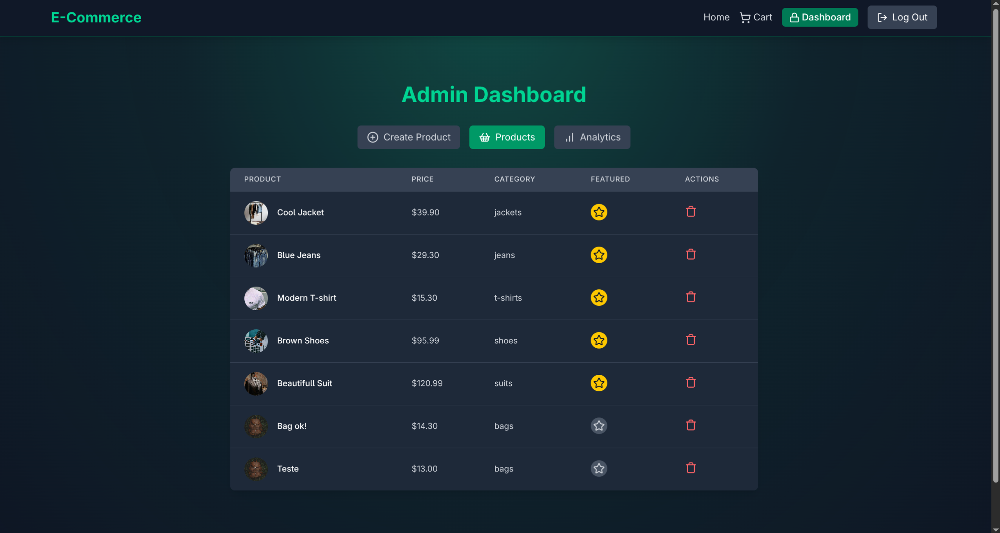
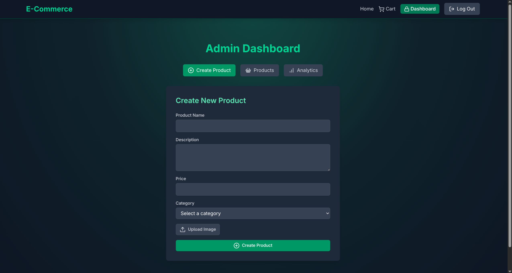
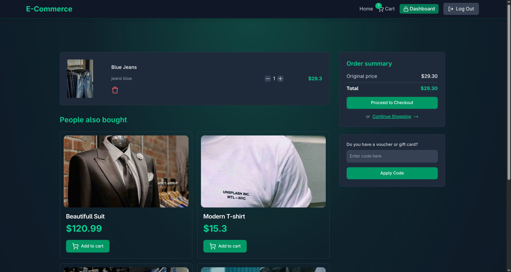
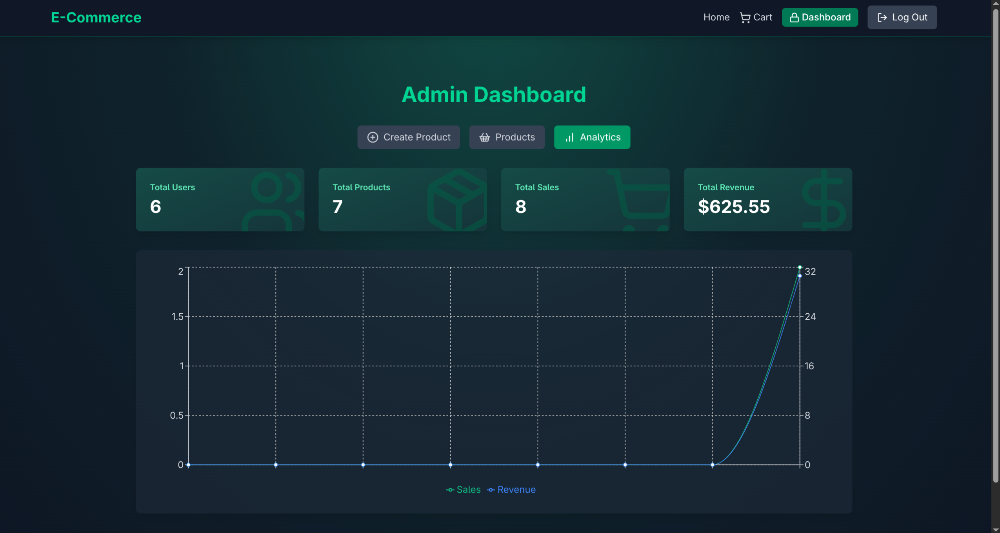

# E-Commerce Store

A full-stack e-commerce application built with React and Node.js, featuring user authentication, product management, shopping cart, payment processing with Stripe, analytics dashboard, and coupon system.

## 📸 Screenshots

### Main Dashboard


The main dashboard serves as the landing page of the application, showcasing various product categories including Jeans, T-shirts, Shoes, Glasses, Jackets, Suits, and Bags. The page features a modern, dark-themed design with a gradient background and displays featured products prominently. Users can navigate through different categories and explore the product catalog.

### Products List


The products list page displays all available products in a grid layout. Each product card shows the product image, name, description, and price. The page includes filtering and search capabilities, allowing users to find products by category or search terms. Products can be added to the cart directly from this view.

### Create Product


The create product page is an admin-only feature that allows administrators to add new products to the store. The form includes fields for product name, description, price, category, and image upload. Images are stored using Cloudinary for efficient cloud-based image management. Admins can also mark products as featured, which will display them on the homepage.

### Shopping Cart


The shopping cart page displays all items that the user has added to their cart. Users can view product details, adjust quantities, remove items, and see the total price. The cart persists across sessions and is stored in the user's account. From this page, users can proceed to checkout using Stripe payment integration.

### Analytics Dashboard


The analytics dashboard provides administrators with comprehensive insights into the store's performance. It displays key metrics such as total sales, number of orders, revenue trends, and daily sales data. The dashboard includes interactive charts and graphs (powered by Recharts) that visualize sales data over time, helping admins make data-driven decisions about inventory and marketing strategies.

## 🚀 Technologies & Libraries

### Backend

- **Node.js** - JavaScript runtime environment
- **Express.js** - Web application framework
- **MongoDB** - NoSQL database (via Mongoose)
- **Redis** (ioredis) - Caching layer for improved performance
- **JWT** (jsonwebtoken) - Authentication and authorization
- **bcryptjs** - Password hashing
- **Stripe** - Payment processing
- **Cloudinary** - Cloud-based image storage and management
- **dotenv** - Environment variable management
- **cookie-parser** - Cookie parsing middleware

### Frontend

- **React 18** - UI library
- **Vite** - Build tool and development server
- **React Router DOM** - Client-side routing
- **Zustand** - State management
- **Axios** - HTTP client
- **Tailwind CSS** - Utility-first CSS framework
- **Framer Motion** - Animation library
- **Recharts** - Chart library for analytics
- **React Hot Toast** - Toast notifications
- **Lucide React** - Icon library
- **React Confetti** - Celebration animations
- **Stripe.js** - Stripe payment integration

### Development Tools

- **Nodemon** - Development server auto-reload
- **ESLint** - Code linting

## ✨ Features

### User Features

- **User Authentication**: Secure signup and login with JWT tokens
- **Product Browsing**: Browse products by category
- **Featured Products**: View highlighted products on homepage
- **Shopping Cart**: Add, remove, and update cart items
- **Checkout**: Secure payment processing with Stripe
- **Order History**: Track past purchases
- **Coupon System**: Apply discount coupons at checkout
- **Gift Coupons**: Automatic gift coupon generation for purchases over $200

### Admin Features

- **Product Management**: Create, update, and delete products
- **Featured Products**: Toggle featured status for products
- **Analytics Dashboard**: View sales metrics and trends
- **Order Management**: Track all orders and sales
- **Image Upload**: Cloudinary integration for product images

### Technical Features

- **Redis Caching**: Featured products cached for improved performance
- **JWT Refresh Tokens**: Secure token refresh mechanism
- **Protected Routes**: Role-based access control
- **Error Handling**: Comprehensive error handling throughout the application
- **Responsive Design**: Mobile-friendly UI with Tailwind CSS
- **Image Optimization**: Cloud-based image storage and CDN

## 📁 Project Structure

```
e-commerce-store/
├── backend/
│   ├── controllers/        # Request handlers
│   │   ├── analytics.controller.js
│   │   ├── auth.controller.js
│   │   ├── cart.controller.js
│   │   ├── coupon.controller.js
│   │   ├── payment.controller.js
│   │   └── product.controller.js
│   ├── lib/                # Utility libraries
│   │   ├── cloudinary.js
│   │   ├── db.js
│   │   ├── redis.js
│   │   └── stripe.js
│   ├── middleware/         # Custom middleware
│   │   └── auth.middleware.js
│   ├── models/             # Database models
│   │   ├── coupon.model.js
│   │   ├── order.model.js
│   │   ├── product.model.js
│   │   └── user.model.js
│   ├── routes/             # API routes
│   │   ├── analytics.route.js
│   │   ├── auth.route.js
│   │   ├── cart.route.js
│   │   ├── coupon.route.js
│   │   ├── payment.route.js
│   │   └── product.route.js
│   └── server.js           # Express server entry point
├── frontend/
│   ├── public/             # Static assets
│   ├── src/
│   │   ├── components/     # React components
│   │   │   ├── AnalyticsTab.jsx
│   │   │   ├── CartItem.jsx
│   │   │   ├── CategoryItem.jsx
│   │   │   ├── CreateProductForm.jsx
│   │   │   ├── FeaturedProducts.jsx
│   │   │   ├── GiftCouponCard.jsx
│   │   │   ├── LoadingSpinner.jsx
│   │   │   ├── Navbar.jsx
│   │   │   ├── OrderSummary.jsx
│   │   │   ├── PeopleAlsoBought.jsx
│   │   │   ├── ProductCard.jsx
│   │   │   └── ProductsList.jsx
│   │   ├── lib/            # Utility functions
│   │   │   └── axios.js
│   │   ├── pages/          # Page components
│   │   │   ├── AdminPage.jsx
│   │   │   ├── CartPage.jsx
│   │   │   ├── CategoryPage.jsx
│   │   │   ├── HomePage.jsx
│   │   │   ├── LoginPage.jsx
│   │   │   ├── PurchaseCancelPage.jsx
│   │   │   ├── PurchaseSuccessPage.jsx
│   │   │   └── SignUpPage.jsx
│   │   ├── stores/         # Zustand state stores
│   │   │   ├── useCartStore.js
│   │   │   ├── useProductStore.js
│   │   │   └── useUserStore.js
│   │   ├── App.jsx
│   │   ├── index.css
│   │   └── main.jsx
│   ├── index.html
│   ├── package.json
│   └── vite.config.js
├── docs/
│   └── images/             # Screenshots
├── package.json
└── README.md
```

## 🔄 Application Flow

### User Authentication Flow

1. User signs up or logs in
2. Backend validates credentials and generates JWT tokens (access + refresh)
3. Tokens stored in HTTP-only cookies
4. Refresh token stored in Redis for session management
5. Access token used for authenticated requests
6. Token refresh mechanism maintains user session

### Product Browsing Flow

1. User visits homepage and sees featured products (cached in Redis)
2. User can browse by category or view all products
3. Products fetched from MongoDB (with Redis caching for featured products)
4. User can add products to cart
5. Cart items stored in user document in MongoDB

### Shopping Cart Flow

1. User adds products to cart (stored in user document)
2. Cart page displays all items with quantities
3. User can update quantities or remove items
4. User can apply coupon codes for discounts
5. User proceeds to checkout

### Checkout & Payment Flow

1. User clicks checkout from cart
2. Frontend creates Stripe checkout session via backend
3. Backend calculates total, applies coupon if valid
4. Stripe session created with product details
5. User redirected to Stripe payment page
6. After payment, user redirected to success/cancel page
7. Backend webhook/endpoint creates order in MongoDB
8. Coupon deactivated if used
9. Gift coupon generated if purchase over $200

### Admin Flow

1. Admin logs in with admin role
2. Admin accesses dashboard at `/secret-dashboard`
3. Admin can:
   - Create/edit/delete products
   - Toggle featured products
   - View analytics and sales data
   - Manage orders

## 🛠️ Installation & Setup

### Prerequisites

- Node.js (v14 or higher)
- MongoDB database
- Redis instance (optional, for caching)
- Stripe account
- Cloudinary account

### Backend Setup

1. Navigate to the project root directory
2. Install dependencies:

```bash
npm install
```

3. Create a `.env` file in the root directory with the following variables:

```env
# Server
PORT=5000
NODE_ENV=development

# Database
MONGODB_URI=your_mongodb_connection_string

# JWT
ACCESS_TOKEN_SECRET=your_access_token_secret
REFRESH_TOKEN_SECRET=your_refresh_token_secret

# Redis (optional)
UPSTASH_REDIS_URL=your_redis_connection_string

# Stripe
STRIPE_SECRET_KEY=your_stripe_secret_key

# Cloudinary
CLOUDINARY_CLOUD_NAME=your_cloudinary_cloud_name
CLOUDINARY_API_KEY=your_cloudinary_api_key
CLOUDINARY_API_SECRET=your_cloudinary_api_secret

# Client
CLIENT_URL=http://localhost:5173
```

4. Start the backend server:

```bash
npm run dev
```

The backend server will run on `http://localhost:5000`

### Frontend Setup

1. Navigate to the frontend directory:

```bash
cd frontend
```

2. Install dependencies:

```bash
npm install
```

3. Start the development server:

```bash
npm run dev
```

The frontend will run on `http://localhost:5173`

## 📡 API Endpoints

### Authentication

- `POST /api/auth/signup` - User registration
- `POST /api/auth/login` - User login
- `POST /api/auth/logout` - User logout
- `POST /api/auth/refresh-token` - Refresh access token
- `GET /api/auth/profile` - Get user profile

### Products

- `GET /api/products` - Get all products
- `GET /api/products/featured` - Get featured products (cached)
- `GET /api/products/category/:category` - Get products by category
- `GET /api/products/recommended` - Get recommended products
- `POST /api/products` - Create product (admin only)
- `DELETE /api/products/:id` - Delete product (admin only)
- `PUT /api/products/:id/toggle-featured` - Toggle featured status (admin only)

### Cart

- `GET /api/cart` - Get cart items
- `POST /api/cart` - Add item to cart
- `PUT /api/cart/:id` - Update cart item quantity
- `DELETE /api/cart` - Remove item from cart or clear cart

### Coupons

- `GET /api/coupons` - Get user's active coupon
- `POST /api/coupons/validate` - Validate coupon code

### Payments

- `POST /api/payments/create-checkout-session` - Create Stripe checkout session
- `POST /api/payments/checkout-success` - Handle successful payment

### Analytics

- `GET /api/analytics` - Get analytics data (admin only)

## 🔐 Security Features

- Password hashing with bcrypt
- JWT-based authentication
- HTTP-only cookies for token storage
- Role-based access control (admin/customer)
- Protected API routes
- Input validation and sanitization
- Secure payment processing with Stripe

## 🎨 UI/UX Features

- Modern dark theme with gradient backgrounds
- Responsive design for all screen sizes
- Smooth animations with Framer Motion
- Toast notifications for user feedback
- Loading states and spinners
- Confetti animations on successful purchases
- Interactive charts and graphs for analytics

## 🚀 Deployment

### Build for Production

1. Build the frontend:

```bash
cd frontend
npm run build
```

2. The backend will serve the frontend in production mode when `NODE_ENV=production`

### Environment Variables for Production

Make sure to set all environment variables in your production environment, including:

- Production MongoDB URI
- Production Redis URL (if using)
- Stripe production keys
- Cloudinary production credentials
- Production client URL

## 📝 License

ISC

## 👤 Author

Tiago Sousa

## 🔗 Repository

[GitHub Repository](https://github.com/tiagosousa10/e-commerce-store)
